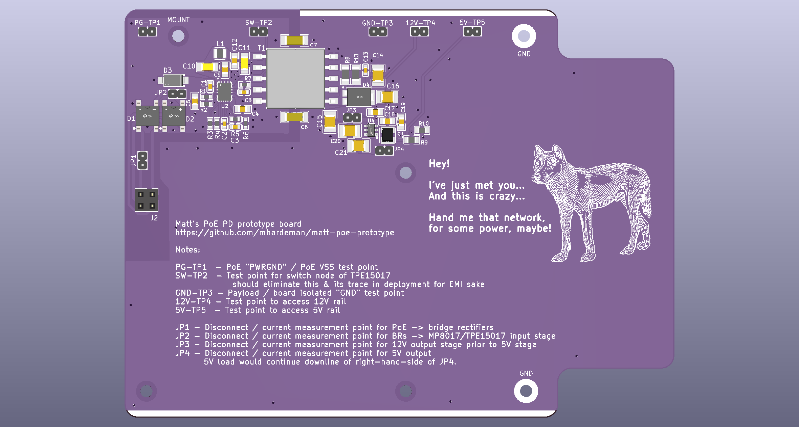
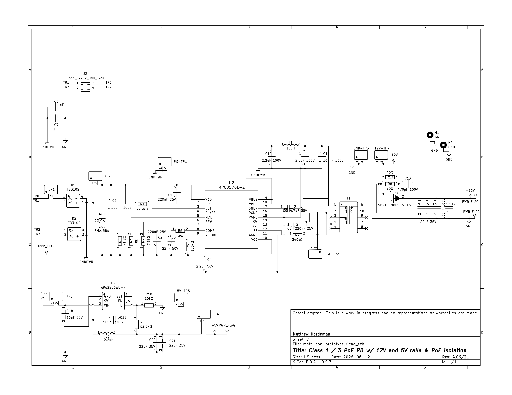
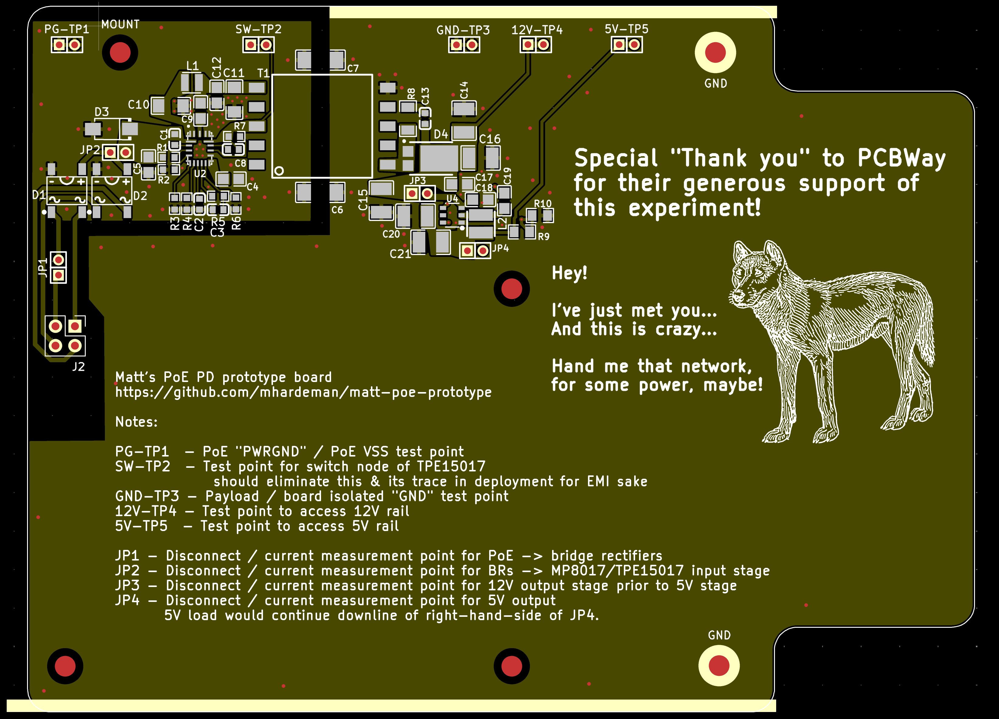

# matt-poe-prototype
This is a KiCad design containing a schematic & PCB layout for a prototype PoE (Power over Ethernet) PD (Powered Device).

It provides for output isolation between the PoE delivery and the output power rails.  It provides for both 12V and 5V output rails, with a common ground for those two rails.

This is a prototype.  I'm happy to accept issues with questions or suggestions for improvement, and would very happily review any pull requests that come in.

## Update 2026/07/09
Apparently some one(s) at [PCBWay](https://pcbway.com) saw this Github project or my post(s) about it on Reddit, because a representative from PCBWay reached out to me and offered to sponsor a run of these boards for free and even let me get a free solder stencil with the boards, all for the simple ask that I provide an honest review of the sponsored boards & stencil.  My review is: they look & feel great, and they function fantastically.  I'll be posting more -- including an assembly and testing video -- in the coming days.  In the mean time, check out the [photos of the PCBWay boards](pcbway/)  All told, PCBWay let me put together a purchase of these boards, the stencil, and some premium options, and shipping, for a total value of over $100 at no cost to me.  It's wonderful to see a company serving both hobbyists and industry ALSO materially contribute!  I'm grateful.

## Detailed Description

This design utilizes the 3Peak TPE15017 and/or Monolithic Power Systems MP8017 -- they're largely interchangeable in this design, though tolerances on the 3Peak seem to be favorable, which can improve your efficiency.  This tiny IC handles the PoE power detection and classification and provides an active-clamp flyback controller with integrated low-side & clamp MOSFETs.  This part, in conjunction with an appropriate transformer provides a 12V output rail, which is further routed in this design to an inexpensive buck converter to provide for a 5V output rail.

In my testing up to this point, this design easily provides at least 10W of usable power out the 5V rail.  I've had it pulling 5V/2A on my DC test load continuously for several days.

[Bill of Materials](matt-poe-prototype.csv)

[More visuals](visuals/)
