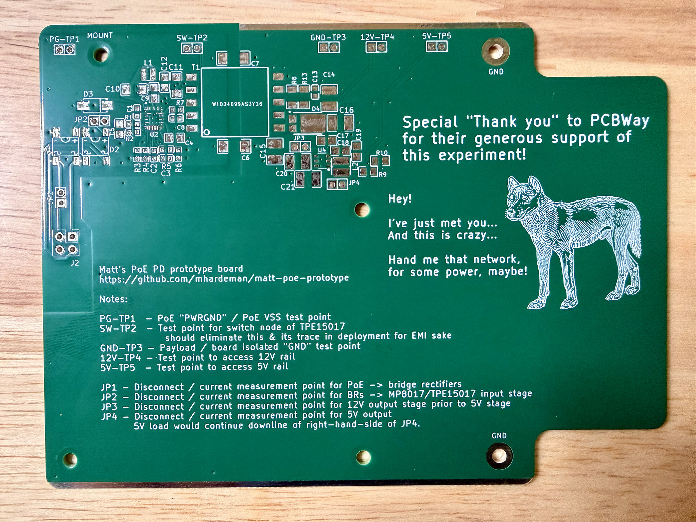
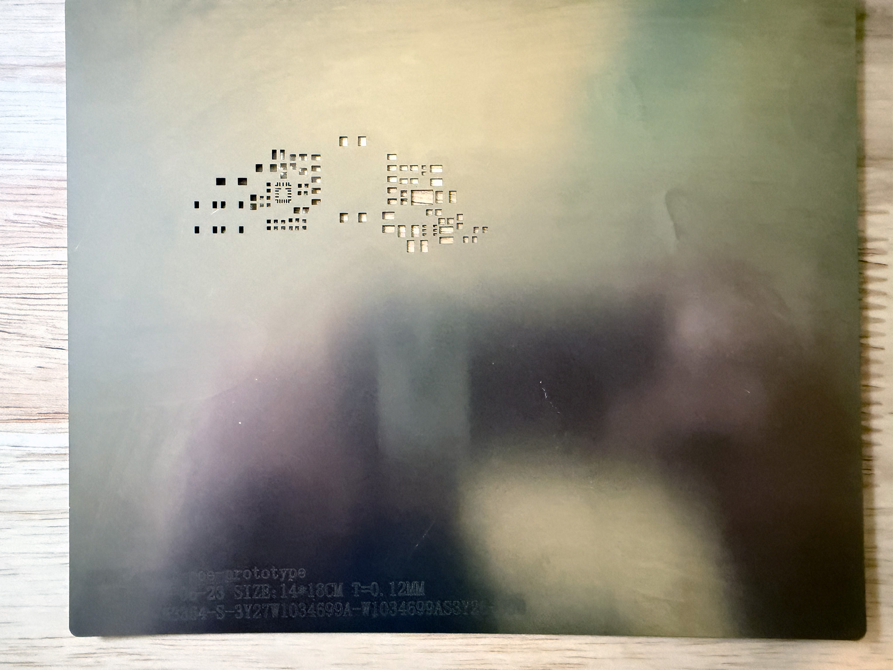
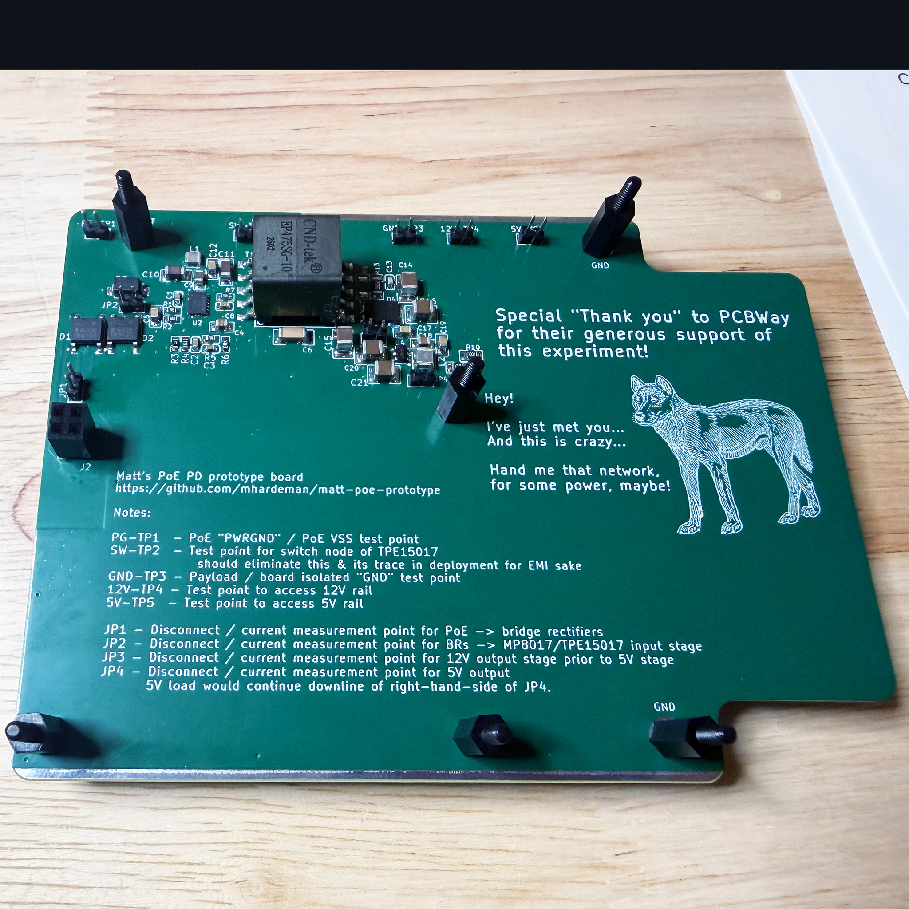

# PCBWay Boards & Stencil
[PCBWay](https://pcbway.com) generously sponsored a run of PCBs and even allowed me to select some premium options, such as 2 ounce copper layers.
Here are a couple of photos of the excellent PCBWay products I received free of charge and a photo of one of the boards as fully assembled by me (Matt).

# Thanks
I once again wish to express my gratitude to PCBWay for sponsoring a run of boards for this PoE powered device prototype.  The boards they provided are perfectly faithful in form, 
look great, feel premium, and function very well.  It's fantastic to see that a major vendor to both hobbyists and industry is actively seeking out opportunities to collaborate
with people who are building in public!
